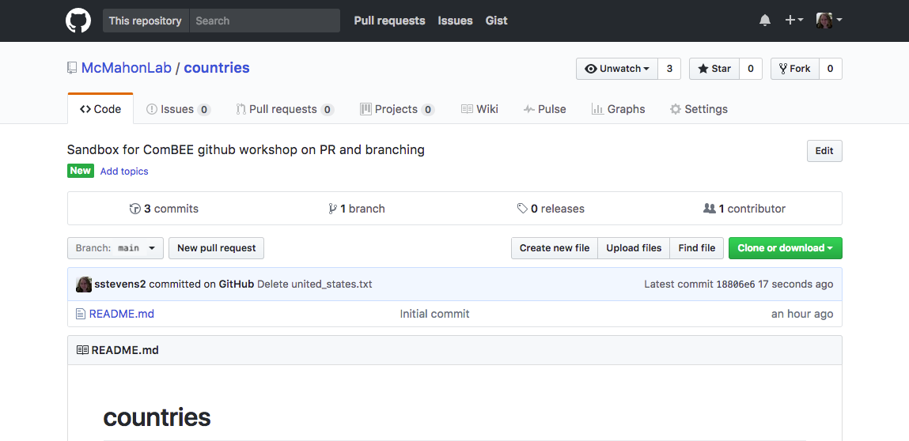
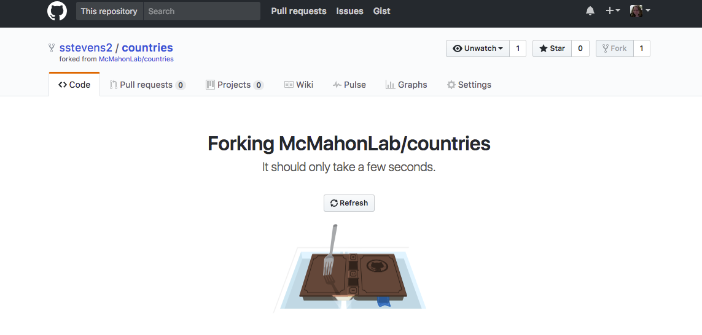
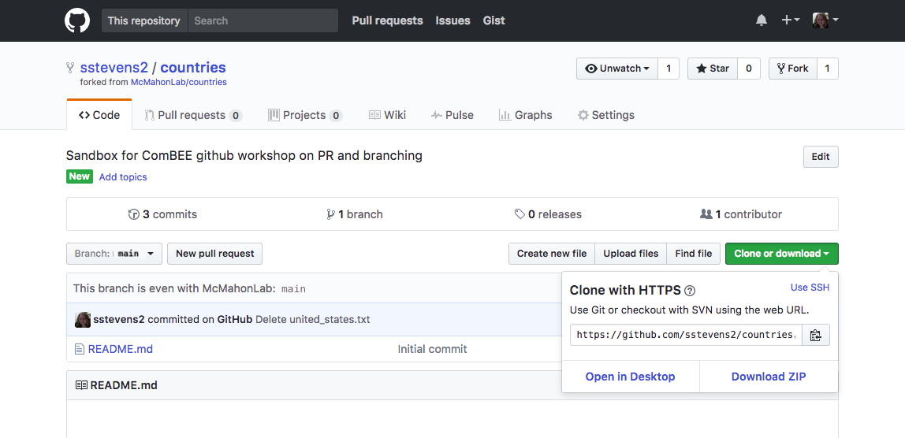
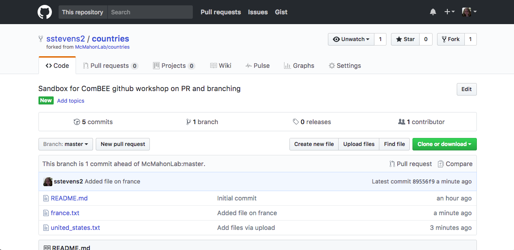
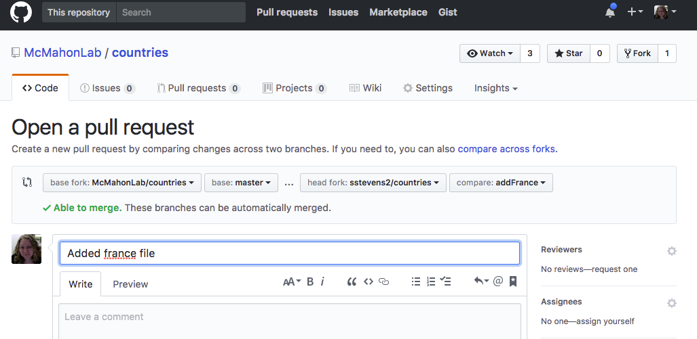
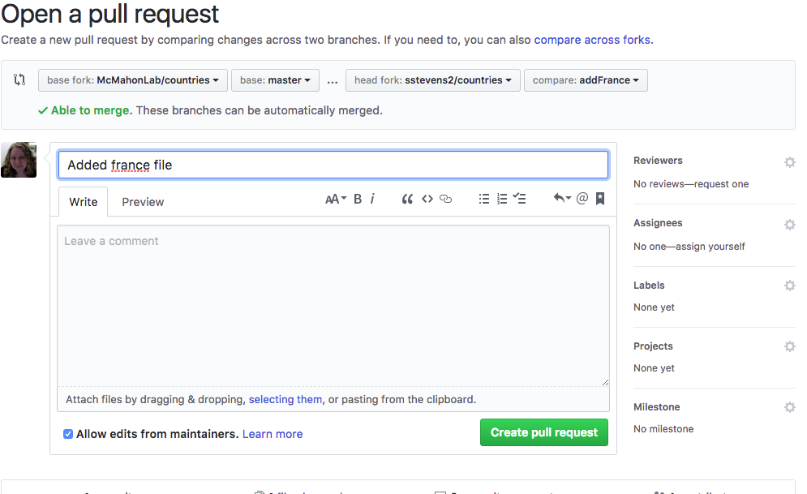

Pull requests are a great way to collaborate with others using github.
Instead of making changes directly to a repository.
This is useful if you don't have permission to modify a repository directly or
you want someone else to review your changes.

For this lesson we will be working on the `countries` repository together.
Open the github link for the `countries` repo
at [https://github.com/McMahonLab/countries](https://github.com/McMahonLab/countries).

Then click the fork button in the upper right hand conner.  

Next we are going to setup the connections to both our forked version and the authoritative version we forked it from.

First we will clone the repo from our forked version so that our version is setup as the 'origin' connection.
Copy the web address for your forked repo (from the web address line or click 'clone and download' and copy that).

Open your terminal and navigate to a folder you'd like to hold this repo, maybe your `Desktop`.
Once there you can clone the repo using the link we just copied.

~~~
$ cd Desktop
$ git clone https://github.com/USERNAME/countries.git
~~~
{: .bash}

~~~
Cloning into 'countries'...
remote: Counting objects: 6, done.
remote: Compressing objects: 100% (4/4), done.
remote: Total 6 (delta 0), reused 6 (delta 0), pack-reused 0
Unpacking objects: 100% (6/6), done.
~~~
{: .output}

Next we will set up a connection or remote to the authoritative repository.
In your browser, you can get back to this repo by clicking on the link in the upper left hand corner,
under your username and repo.

Copy the web address for this repo (from the web address line or click the 'clone and download' and copy that).

Then back in your terminal, navigate in the cloned repo and add the remote connection.
For this command we must give the new connection a different nickname, where our original connection is 'origin'
this new connection will be called 'upstream'.
You could give it a different nickname but often the authoritative is often 'upstream'

~~~
$ cd countries
$ git remote add upstream https://github.com/McMahonLab/countries.git
~~~
{: .bash}

At anytime you can see the remote connections your repo has using the following command:

~~~
$ git remote -v
~~~
{: .bash}

~~~
origin	https://github.com/USERNAME/countries.git (fetch)
origin	https://github.com/USERNAME/countries.git (push)
upstream	https://github.com/McMahonLab/countries.git (fetch)
upstream	https://github.com/McMahonLab/countries.git (push)
~~~
{: .output}

Now that we have this setup done, which is only needed the first time, we can now suggest changes to this repo.
Each person will add info about a specific country to the repo.
Since you cloned the repo a template file with info on the United States has been added.
First we will update our local version of the repo, with this change.

~~~
$ git pull upstream master
~~~
{: .bash}

Now your local version of the repo is updated but our forked version of the repo is not yet up to date.
Now we will update the our forked version.

~~~
$ git push origin master
~~~
{: .bash}

Now you can add your country to repo.
First copy `united_states.txt` and change the name to the name of your chosen country.
Then edit the contents to reflect the info of your country.

~~~
$ cp united_states.txt france.txt
$ nano france.txt
$ cat france.txt
~~~
{: .bash}

~~~
Population: 66,991,000
Capitol: Paris
~~~
{: .output}

Next add and commit the changes to the repo.

~~~
$ git add france.txt
$ git commit -m "Added file on france"
~~~
{: .bash}

~~~
[master 79a312a] Added file on france
 1 file changed, 2 insertions(+), 2 deletions(-)
~~~
{: .output}

Now we can push those changes to our forked version of the repo.
Since we don't have permissions to the upstream repo or we want to suggest these changed be
reviewed, if we do have permissions, we won't push directly to the upstream repo.

~~~
$ git push origin master
~~~
{: .bash}

~~~
Counting objects: 4, done.
Delta compression using up to 4 threads.
Compressing objects: 100% (4/4), done.
Writing objects: 100% (4/4), 783 bytes | 0 bytes/s, done.
Total 4 (delta 3), reused 0 (delta 0)
remote: Resolving deltas: 100% (3/3), completed with 3 local objects.
To https://github.com/USERNAME/countries.git
   2037539..79a312a  master -> master
~~~
{: .output}

Next go to your forked github version of the repo and reload the page.
You should see the changes in your version of the repo.

Then click the 'New pull request' button.

The base fork should be the upstream version and then the head fork should be your version.
Then click the 'create pull request button'.

Now someone with privileges to the upstream repo can review it, give comments and
suggestions, and merge it into the upstream version.

Let's add a line to our file and see how/if this changes our pull request.

~~~
$ nano france.txt
$ cat france.txt
~~~
{: .bash}

~~~
Population: 66,991,000
Capitol: Paris
Largest City: Paris
~~~
{: .output}

Next we will add and commit these changes.
Then we will push them to our forked version of the repo.

~~~
$ git add france.txt
$ git commit -m "Added largest city to france file"
$ git push origin master
~~~
{: .bash}

Now if we reload the pull request.  The new commit was added to that pull request.

This is great for our purposes but you can imagine you may want to suggest changes that
aren't linked to one another.
This is one place where branches come in.
We can put the changes in a different branch and make a separate pull request for that branch.
Branches can also be useful when you are developing a new function in your script and you
don't want to 'break' the current version that is published in your repo.

We will use a new branch and pull request to suggest the addition of a second country.
You can create a branch and then switch to it with the following commands:

~~~
$ git branch addItaly
$ git checkout addItaly
~~~
{: .bash}

~~~
Switched to branch 'addItaly'
~~~
{: .output}

**OR** you can create the branch and switch to it in one step

~~~
$ git checkout -b addItaly
~~~
{: .bash}

~~~
Switched to branch 'addItaly'
~~~
{: .output}

> ## Add new country file and make PR
>
> - Copy your first country file into a new country
> - Edit the file to include info on the new country
> - Add and commit this new file
> - Push the new changes to github
> > ## Solution
> >
> > ~~~
> > $ cp france.txt italy.txt
> > $ nano italy.txt #Add the right info into the file
> > $ git add italy.txt
> > $ git commit -m "Added file on Italy"
> > $ git push origin master
> > ~~~
> > {: .bash}
> {: .solution}
{: .challenge}

> ## What branches exist
>
> To see what branches exist of which branch you are on, you can type:
> 
> ~~~
> git branch
> ~~~
> {: .bash}
> ~~~
>   addItaly
> * master
> ~~~
> {: .output}
{: .callout}

> ## Deleting a branch
>
> To delete you can type:
> 
> ~~~
> git branch -d add Italy
> ~~~
> {: .bash}
> ~~~
> Deleted branch addItaly (was 58c24c2).
> ~~~
> {: .output}
{: .callout}

